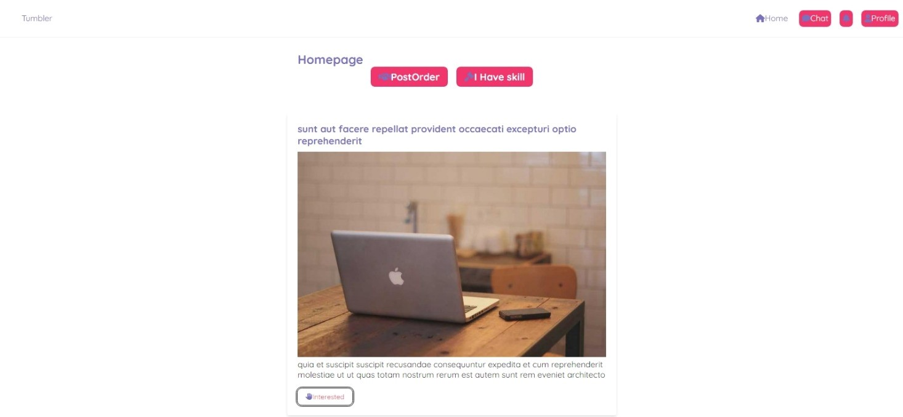
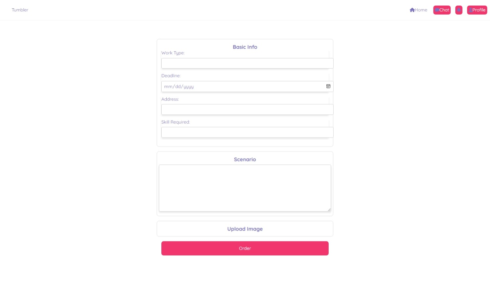

# What is tumbler?

--------------------------------------------------------------------------------

you can see the live version of this project [here](http://test.nftalem.tech/)
--------------------------------------------------------------------------------

Tumbler is a commercial platform where you can get anything that can fixed by your local repairman. It is a platform where you can get your broken phone fixed, your broken laptop fixed, your broken car fixed, your broken house fixed, your broken anything fixed. It is a platform where you can get your broken anything fixed by your local repairman.

# Why tumbler?

in my country there is no platform where you can get your broken anything fixed by your local repairman. So I decided to create one.

# How to use tumbler?

since it prortfolio project it not yet available for public use. But you can test it by cloning this repo and running it on your local machine.

* Frontpage

* Order Form


# what are available features?

* user can register
* user can login
* register siklls
* register services
* register products
* post a job to be done

# 🚀 usage

## 📦 install dependencies

```bash
npm install
```

## 🏃‍♂️ run the app

```bash
npm start
```

## 🏃‍♂️ run the app in development mode

```bash
npm run dev
```

## 🏃‍♂️ run the app in production mode

```bash
npm run prod
```

# 🧑🏿 Author

* [Roblepop]()
